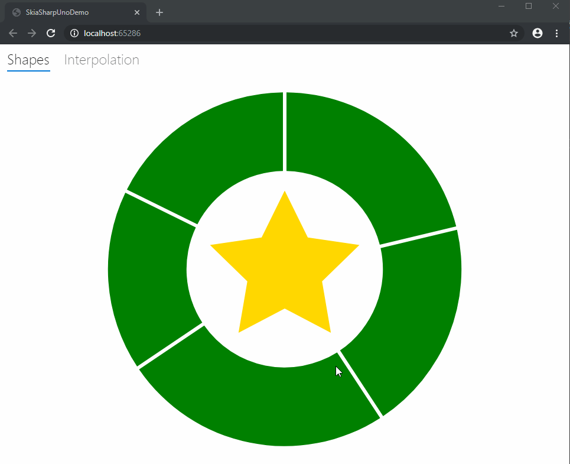
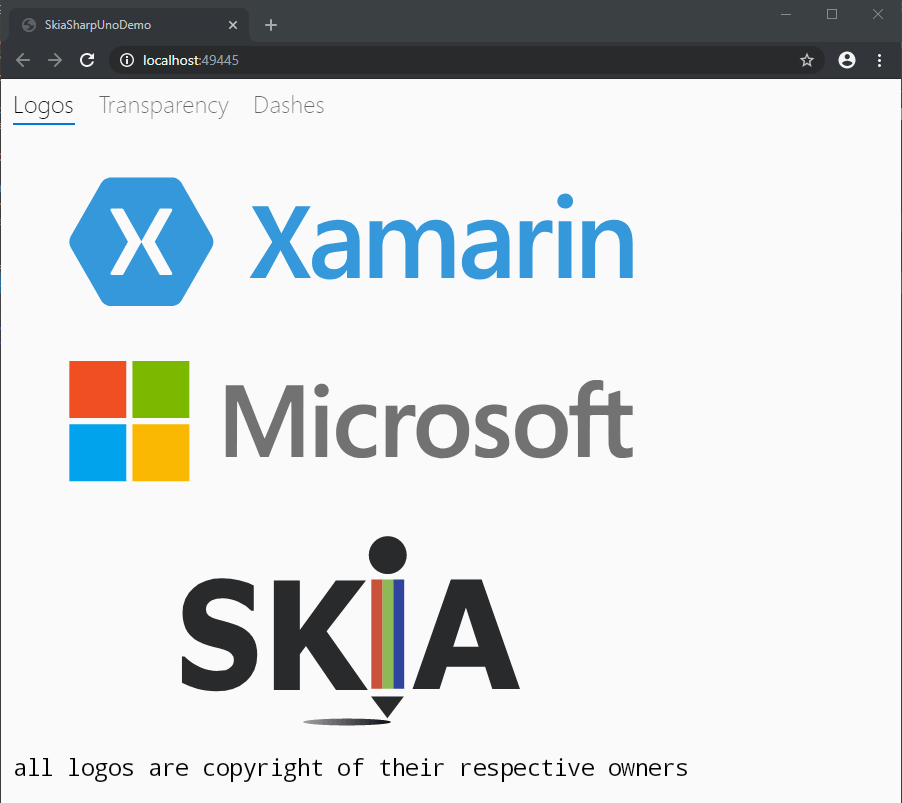

# SkiaSharp.Extended for WebAssembly

This repository is the home for the port of [SkiaSharp.Extended](https://github.com/mono/SkiaSharp.Extended) packages 
for WebAssembly with the Uno Platform. This package uses the [Uno.SkiaSharp.Wasm](https://www.nuget.org/packages/Uno.SkiaSharp.Wasm) package for WebAssembly.

**SkiaSharp.Extended** is a collection some cool libraries that may be
useful to some apps. There are several repositories that may have
interesting projects:

 - [SkiaSharp][skiasharp] _(the engine)_
 - [SkiaSharp.Extended][extended] _(additional APIs)_
 - [SkiaSharp.Extended.Iconify][iconify] _(iconify library)_ (Not yet supported for WebAssembly)
 - [SkiaSharp.Extended.Svg][svg] _(lightweight SVG loader)_

## Using SkiaSharp.Extended on WebAssembly

The support for Extended and SVG is provided in the form of two packages :

- [Uno.SkiaSharp.Wasm.Extended](https://www.nuget.org/packages/Uno.SkiaSharp.Wasm.Extended)
- [Uno.SkiaSharp.Wasm.Svg](https://www.nuget.org/packages/Uno.SkiaSharp.Wasm.Svg)

Those packages can only be used on a WebAssembly head running on top of the Uno Platform. For other heads, see use of the official [Extended](https://www.nuget.org/packages/SkiaSharp.Extended/) and [Svg](https://www.nuget.org/packages/SkiaSharp.Svg/) packages.

Some samples of the apps ([Extended](https://github.com/unoplatform/Uno.SkiaSharp.Extended/blob/uno/SkiaSharp.Extended/SkiaSharpUnoDemo/SkiaSharpUnoDemo.Shared/MainPage.xaml) and [Svg](https://github.com/unoplatform/Uno.SkiaSharp.Extended/blob/uno/SkiaSharp.Extended.Svg/SkiaSharpUnoDemo/SkiaSharpUnoDemo.Shared/MainPage.xaml.cs)) in the repository:

## Building 

Open either the [Svg](https://github.com/unoplatform/Uno.SkiaSharp.Extended/tree/uno/SkiaSharp.Extended.Svg) solution or the [Extended](https://github.com/unoplatform/Uno.SkiaSharp.Extended/tree/uno/SkiaSharp.Extended) solution and build the included sample apps.

## License

The code in this repository is licensed under the [MIT License][license].

[license]: https://github.com/mono/SkiaSharp.Extended/blob/master/LICENSE
[netcore]: https://www.microsoft.com/net/core

[skiasharp]: https://github.com/mono/SkiaSharp
[extended]: https://github.com/mono/SkiaSharp.Extended/tree/master/SkiaSharp.Extended
[iconify]: https://github.com/mono/SkiaSharp.Extended/tree/master/SkiaSharp.Extended.Iconify
[svg]: https://github.com/mono/SkiaSharp.Extended/tree/master/SkiaSharp.Extended.Svg
